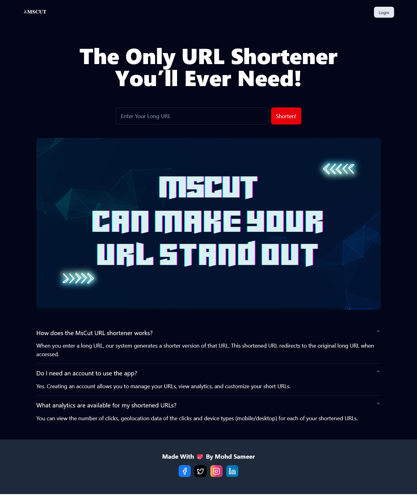

# **MSCUT Full-Stack URL Shortener**



## **Overview**

The URL Shortener is a full-stack web application that enables users to create short URLs, track analytics, generate QR codes, and manage their links. With a clean and responsive UI, the platform offers authentication, link management, and real-time tracking for an enhanced user experience.

## **Features**

-   **User Authentication** – Secure signup, login, and JWT-based session management
-   **Shorten URLs** – Generate short links with optional custom aliases
-   **QR Code Generation** – Instantly create QR codes for each shortened URL
-   **Click Analytics** – Track user clicks, devices, and locations
-   **Dashboard** – View and manage all shortened URLs in one place
-   **Copy & Share** – Easily copy short URLs and share them
-   **Persistent State** – Uses Redux Persist to save user session
-   **Fully Responsive** – Optimized for mobile and desktop users

## **Technologies Used**

-   **Frontend:** React.js (with Redux Toolkit & Redux Persist)
-   **Styling:** TailwindCSS & ShadCN
-   **Backend:** Node.js / Express.js
-   **Database:** MongoDB with Mongoose ORM
-   **Authentication:** JWT-based authentication
-   **QR Code Generation:** qrcode package
-   **Click Analytics:** ua-parser-js (for device detection)
-   **Hosting & Deployment:** Render

## **Installation**

To set up the project locally, follow these steps:

### Frontend Setup

1. Navigate to the `frontend` directory:

    ```bash
    cd frontend
    ```

2. Install dependencies:

    ```bash
    yarn
    ```

3. Set up environment variables:

    ```bash
    cp .env.sample .env
    ```

    Update `.env` file with your credentials (e.g., Backend URL,etc.).

4. Start the frontend server:
    ```bash
    yarn start
    ```
    The frontend should be accessible at `http://localhost:5173`.

---

### Backend Setup

1. Navigate to the `backend` directory:
    ```bash
    cd ../backend
    ```
2. Install dependencies:
    ```bash
    yarn
    ```
3. Set up environment variables:

    ```bash
    cp .env.sample .env
    ```

    Update `.env` file with your credentials (e.g., database URI, JWT secret, etc.).

4. Start the backend server:
    ```bash
    npm run dev
    ```
    The backend should be accessible at `http://localhost:8000`.

---

## **Usage**

-   Sign up or log in to access your dashboard.
-   Shorten a URL by entering a long link and generating a short alias.
-   Copy the short URL and share it anywhere.
-   Track analytics – View click count, location, and device data.
-   Generate QR codes for easy mobile access.
-   Manage URLs – Edit or delete shortened links from your dashboard.

## **Development & Contribution**

### Steps to Contribute

1. Clone the repository:
    ```bash
    git clone https://github.com/ma3llim007/mscut.git
    ```
2. Create a new branch:
    ```bash
    git checkout -b feature/your-feature-name
    ```
3. Implement your changes and commit:
    ```bash
    git add .
    git commit -m "Describe your changes here"
    ```
4. Push to GitHub:
    ```bash
    git push origin feature/your-feature-name
    ```
5. Open a pull request on GitHub and describe your changes.

## **Contribution Guidelines**

-   Follow project structure and best practices.
-   Submit detailed pull requests with clear descriptions.
-   Report bugs and suggest improvements via GitHub Issues.

## **License**

This project is licensed under the MIT License - see the [LICENSE](LICENSE) file for details.

## **Acknowledgements**

-   **React.js & Redux Toolkit** – Scalable and efficient state management
-   **TailwindCSS & ShadCN** – Modern and responsive UI components
-   **Express.js & MongoDB** – Robust backend and database architecture
-   **JWT Authentication** – Secure user authentication system
-   **QR Code & Click Tracking** – Seamless analytics for URLs
